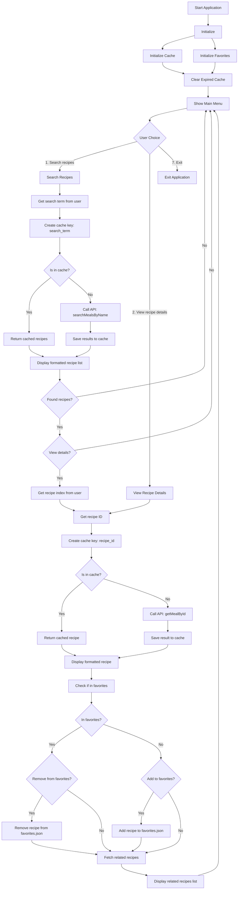

# Recipe Explorer CLI Flowchart Documentation

## Overview

This document provides a detailed explanation of the Recipe Explorer CLI application's workflow as visualized in the accompanying flowchart. The flowchart illustrates the application's architecture, control flow, and key asynchronous JavaScript patterns implemented throughout the codebase.

## Mermaid Diagram

To include the flowchart in a Markdown file, use the following code fence syntax:

